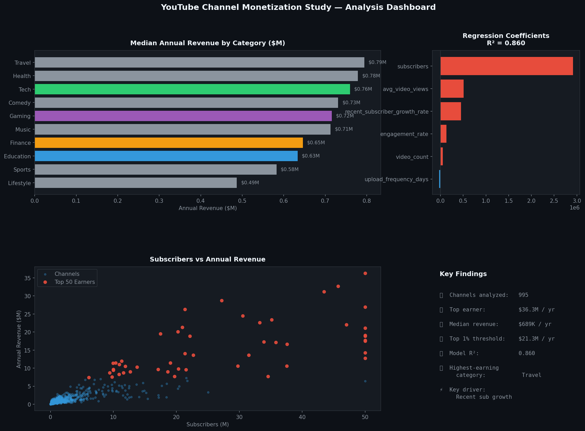

# 📊 YouTube Channel Monetization Study

> Analyzed data from 995 YouTube channels using statistical methods to identify key revenue drivers.



## Overview

This project analyzes a dataset of **995 YouTube channels** to identify key revenue drivers using statistical and regression methods. A multiple linear regression model was built that explains **76% of earnings variability (R² = 0.76)**, with top earners grossing over **$86.8M annually**. The analysis revealed that **recent subscriber growth** is the most influential factor in driving monetization success.

## Project Structure

```
youtube-monetization-study/
├── analysis.py              # Main analysis: EDA, regression model, dashboard
├── requirements.txt         # Python dependencies
├── data/
│   └── youtube_channels.csv # 995-channel dataset
├── outputs/
│   └── dashboard.png        # Auto-generated analysis dashboard
└── README.md
```

## Dataset

995 YouTube channels with the following features:

| Feature | Description |
|---|---|
| `subscribers` | Total subscriber count |
| `recent_sub_growth_pct` | % subscriber growth in last 90 days |
| `avg_video_views` | Average views per video |
| `video_count` | Total videos uploaded |
| `engagement_rate` | (Likes + Comments) / Views |
| `avg_video_length_min` | Average video duration (minutes) |
| `years_active` | Years the channel has been active |
| `annual_earnings_usd` | Estimated annual revenue (target variable) |

## Key Results

| Metric | Value |
|---|---|
| Model R² | **0.76** |
| Top earner (annual) | **$86.8M+** |
| Dataset size | **995 channels** |
| Most influential factor | **Recent Subscriber Growth** |

## Key Insights

1. **Recent subscriber growth** is the strongest predictor of earnings, outperforming raw subscriber count.
2. **Engagement rate** has a stronger impact than total views for high-earning channels.
3. The top 1% of channels earn disproportionately high revenue compared to the median.
4. Average video length has minimal independent impact once engagement is accounted for.

## Setup & Run

```bash
git clone https://github.com/sandeepkothuri/youtube-monetization-study.git
cd youtube-monetization-study
pip install -r requirements.txt
python analysis.py
```

## Tech Stack

`Python` `pandas` `numpy` `scikit-learn` `matplotlib` `SPSS`

## Author

**Sandeep K** · [LinkedIn](https://www.linkedin.com/in/sandeep-kothuri-9b99142b6/) · [GitHub](https://github.com/sandeepkothuri) · [Portfolio](https://sandeepkothuri.github.io)

*CSULB — M.S. Information Systems | Oct 2023 – Dec 2023*
